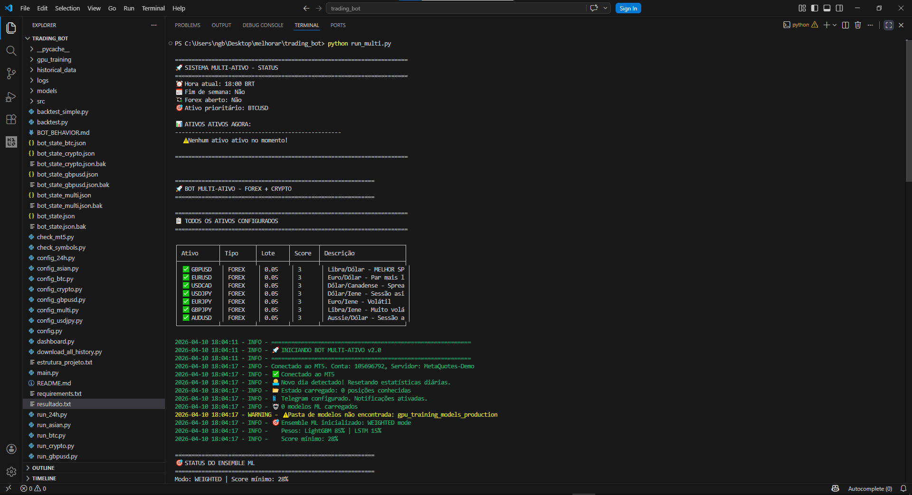
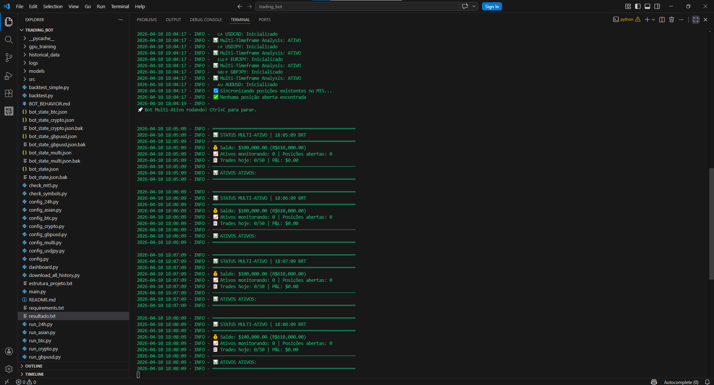
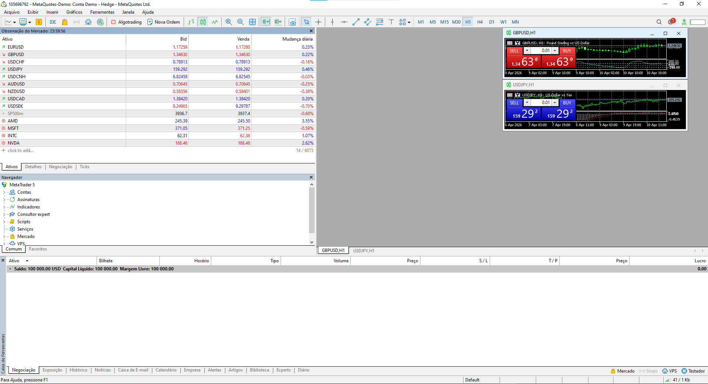

# 🤖 Trading Bot PRO 4.0 - Multi-Asset Scalper + Ensemble ML

[](https://www.python.org/)
[](https://www.metatrader5.com/)
[](https://lightgbm.readthedocs.io/)
[](https://www.tensorflow.org/)
[](LICENSE)

Sistema de trading algorítmico profissional que opera **7 pares Forex simultaneamente** usando **Ensemble Machine Learning** (LightGBM + LSTM) combinado com **Smart Money Concepts** (ICT).

## 🖼️ Screenshots

### Bot em Execução

<p align="center">
  
  <br/>
  <em>Bot carregando 7 modelos ML (LightGBM + LSTM)</em>
</p>

<p align="center">
  
  <br/>
  <em>Análise de mercado com 9 confirmações Smart Money</em>
</p>

### Plataforma

<p align="center">
  
  <br/>
  <em>Integração com MetaTrader 5 via API Python</em>
</p>

---

## 🎯 Objetivo

Meta de **R$100/dia** operando scalping conservador:
- **Lote**: 0.05 (~$0.35/pip)
- **Meta por trade**: $1 (~3 pips)
- **Trades necessários**: 19 trades vencedores
- **SL**: ~5 pips | **TP**: ~10 pips (saída manual com $1)

---

## ✨ Funcionalidades

### 🚀 Multi-Asset Trading
Opera 7 pares Forex simultaneamente com configurações otimizadas:

| Ativo | Emoji | Spread Máx | Horário BRT | Lote |
|-------|-------|------------|-------------|------|
| GBPUSD | 🇬🇧 | 10 pips | 4h-18h | 0.05 |
| EURUSD | 🇪🇺 | 10 pips | 4h-18h | 0.05 |
| USDCAD | 🇨🇦 | 10 pips | 9h-18h | 0.05 |
| USDJPY | 🇯🇵 | 15 pips | 0h-4h, 9h-18h, 21h-24h | 0.05 |
| EURJPY | 🇪🇺🇯🇵 | 20 pips | 4h-18h, 21h-24h | 0.05 |
| GBPJPY | 🇬🇧🇯🇵 | 25 pips | 4h-18h | 0.05 |
| AUDUSD | 🇦🇺 | 12 pips | 0h-4h, 9h-18h, 19h-24h | 0.05 |

### 🧠 Ensemble Machine Learning
Combina dois modelos para decisões mais robustas:

| Modelo | Peso | Métrica | Descrição |
|--------|------|---------|-----------|
| **LightGBM** | 85% | Precision ~50% | Rápido, eficiente |
| **LSTM** | 15% | F1 ~25-35% | Padrões temporais |

**Voting Mode**: WEIGHTED (ponderado)  
**Score Mínimo**: 28% (ensemble combinado)

### 📊 Modelos Treinados

#### LightGBM (Local - 6 meses de dados)
| Ativo | Precision | F1 Score | Threshold |
|-------|-----------|----------|-----------|
| GBPUSD | 51.8% | 40.9% | 40% |
| EURUSD | 50.8% | 35.5% | 40% |
| USDCAD | 48.6% | 42.9% | 40% |
| USDJPY | 52.0% | 45.2% | 40% |
| EURJPY | 47.3% | 40.5% | 40% |
| GBPJPY | 51.1% | 33.4% | 40% |
| AUDUSD | 57.2% | 42.5% | 40% |

#### LSTM (GPU H100 - 3 anos de dados)
| Ativo | F1 Score |
|-------|----------|
| AUDUSD | 34.5% |
| GBPJPY | 34.3% |
| USDJPY | 31.4% |
| EURJPY | 29.0% |
| GBPUSD | 26.9% |
| EURUSD | 24.9% |
| USDCAD | 16.4% |

### 🎯 Sistema de Score 9/9
9 confirmações antes de cada trade:
1. ✅ SMA Crossover
2. ✅ RSI Momentum
3. ✅ MACD
4. ✅ Preço vs SMA21
5. ✅ Volume
6. ✅ ADX + DI
7. ✅ Market Structure (HH/HL/LH/LL)
8. ✅ BOS + Pullback
9. ✅ Order Block

### 🛡️ Smart Money Concepts (ICT)
- **Order Blocks Detection**: Zonas institucionais
- **Break of Structure (BOS)**: Rompimentos + pullback 30-70%
- **Market Structure**: Identifica HH/HL/LH/LL
- **Anti-Stop Hunt**: Evita SL em números redondos (+5 pips buffer)
- **Session Filter**: Killzones Londres (5h-7h) e NY (10h-12h)
- **Spread Filter**: Bloqueia spread > 2x média

### 💰 Smart Exit
Saída inteligente com lucro garantido:
- ✅ Sai automaticamente com **$1 de lucro** (R$5.38)
- ✅ Aguarda 5 minutos se negativo
- ✅ Emergency Exit se perder 5% em 1 trade (~$1.75)
- ✅ Take Profit on Recovery

### 🛡️ Gestão de Risco
| Proteção | Valor |
|----------|-------|
| Perda diária máx | 20% (R$40) |
| Trades/dia máx | 50 |
| Cooldown mesmo ativo | 30 segundos |
| Cooldown entre ativos | 5 segundos |
| Max posições | 7 (1 por ativo) |
| Risco por trade | 1.5% (~R$3) |

---

---

## 📚 Documentação Completa

Toda a documentação está organizada na pasta [`docs/`](docs/):

### 📊 Análise e Arquitetura
- **[Análise Completa](docs/ANALISE_COMPLETA_TRADING_BOT.md)** - Visão geral técnica do projeto
- **[Funcionalidades Avançadas](docs/FUNCIONALIDADES_AVANCADAS_BOT.md)** - Telegram e horários inteligentes
- **[Funcionalidades Não Documentadas](docs/FUNCIONALIDADES_NAO_DOCUMENTADAS.md)** - 15 funcionalidades "escondidas"

### 📱 Publicação
- **[Posts LinkedIn](docs/POSTS_LINKEDIN_FINAL.md)** - 5 versões de posts prontos
- **[Checklist de Publicação](docs/CHECKLIST_PUBLICACAO_GITHUB_LINKEDIN.md)** - Guia passo a passo
- **[Comandos Rápidos](docs/COMANDOS_RAPIDOS.md)** - Comandos prontos para copiar/colar

### 📸 Screenshots
- **[Guia de Screenshots](docs/GUIA_SCREENSHOTS_TRADING_BOT.md)** - Como capturar screenshots profissionais
- **[Screenshots Atuais](docs/screenshots/)** - 3 capturas já realizadas

---

## 🚀 Como Usar

### Pré-requisitos
- Python 3.14+
- MetaTrader 5 instalado
- Conta de trading (demo ou real)

### Instalação

```bash
# Clone o repositório
git clone https://github.com/cauaprjct/trading-bot.git
cd trading-bot

# Instale as dependências
pip install -r requirements.txt

# Configure suas credenciais MT5
# Edite config_multi.py com seus dados
```

### Configuração

Edite `config_multi.py`:

```python
# Credenciais MT5
MT5_LOGIN = 12345678
MT5_PASSWORD = "sua_senha"
MT5_SERVER = "MetaQuotes-Demo"

# Capital inicial
SIMULATED_CAPITAL_BRL = 200.0
SIMULATED_CAPITAL_USD = 33.0

# Telegram (opcional)
TELEGRAM_BOT_TOKEN = "seu_token"
TELEGRAM_CHAT_ID = "seu_chat_id"
```

### Execução

#### Multi-Asset (Recomendado)
```bash
python run_multi.py
```

Opera 7 pares simultaneamente com Ensemble ML.

#### Single-Asset
```bash
python main.py
```

Opera apenas EURUSD (ideal para testes).

#### Bitcoin 24/7
```bash
python run_btc.py
```

Opera BTC/USD 24 horas por dia.

---

## 🧠 Machine Learning

### Treinar Modelos LightGBM

```bash
# Treina todos os 7 modelos
python train_all_models.py

# Treina apenas 1 modelo
python train_ml_model.py --symbol EURUSD
```

**Tempo estimado**: ~10 minutos (7 modelos)

### Treinar Modelos LSTM (GPU)

```bash
cd gpu_training

# Pipeline completo
python run_full_pipeline.py \
    --symbols EURUSD GBPUSD USDJPY USDCAD AUDUSD EURJPY GBPJPY \
    --model lstm \
    --epochs 100 \
    --optuna-trials 200

# Exporta para produção
python export_to_production.py
```

**Tempo estimado**: ~3 horas (GPU H100)

---

## 📊 Backtesting

```bash
# Backtest simples
python backtest_simple.py

# Backtest completo
python backtest.py --symbol EURUSD --days 30
```

---

## 📁 Estrutura do Projeto

```
trading_bot/
├── src/
│   ├── domain/          # Entidades e interfaces
│   ├── infrastructure/  # MT5Adapter
│   ├── strategies/      # Estratégias de trading
│   └── utils/           # Filtros e utilitários
├── models/              # Modelos LightGBM (.pkl)
├── gpu_training/        # Pipeline LSTM (GPU)
│   ├── historical_data/ # Dados históricos (3 anos)
│   ├── train_deep_model.py
│   └── optimize_hyperparams.py
├── historical_data/     # Dados locais (6 meses)
├── logs/                # Logs de execução
├── run_multi.py         # 🎯 Bot multi-asset
├── main.py              # Bot single-asset
├── config_multi.py      # Configurações multi-asset
├── train_all_models.py  # Treina 7 modelos LightGBM
└── README.md
```

---

## 🎮 Modos de Operação

| Script | Descrição |
|--------|-----------|
| `run_multi.py` | 🎯 **PRINCIPAL** - 7 pares simultâneos |
| `main.py` | Single-asset (EURUSD) |
| `run_btc.py` | Bitcoin 24/7 |
| `run_crypto.py` | Multi-crypto (BTC+ETH+SOL) |
| `run_asian.py` | Sessão asiática |
| `run_24h.py` | 24h com troca de sessão |

---

## 📈 Estratégias

### 1. Trend Following
- **Quando**: ADX >= 20 (mercado com tendência)
- **Indicadores**: SMA, RSI, MACD, ADX

### 2. Mean Reversion
- **Quando**: ADX < 20 (mercado lateral)
- **Indicadores**: Bollinger Bands, Z-Score, RSI

### 3. Hybrid Mode (v3.0+)
- Escolhe automaticamente entre Trend/Mean Reversion
- ML Signal Filter
- Multi-Timeframe Analysis (H1 confirma M5)

### 4. Scalper Mode (v4.0)
- Lote: 0.05
- Meta: $1 por trade
- Cooldown: 30s

---

## 📱 Notificações Telegram

O bot envia notificações de:
- ✅ Trade executado (com valor em risco)
- 💰 Trade fechado (lucro/perda)
- ⚠️ Erros e alertas
- 📊 Status do bot

---

## ⚙️ Configurações Principais

```python
# config_multi.py

# Lote e risco
VOLUME = 0.05              # $0.35/pip
ATR_MULT_SL = 0.5          # SL ~5 pips
ATR_MULT_TP = 1.0          # TP ~10 pips

# Smart Exit
SMART_EXIT_MIN_PROFIT_USD = 1.00  # Sai com $1 lucro

# Limites
MAX_DAILY_TRADES = 50
MAX_TOTAL_POSITIONS = 7
MIN_SECONDS_BETWEEN_TRADES = 30

# Ensemble ML
USE_ENSEMBLE_ML = True
ENSEMBLE_MIN_SCORE = 0.28
ENSEMBLE_LGBM_WEIGHT = 0.85
ENSEMBLE_LSTM_WEIGHT = 0.15
```

---

## 🔧 Utilitários

```bash
# Verifica conexão MT5
python check_mt5.py

# Lista símbolos disponíveis
python check_symbols.py

# Baixa histórico
python download_all_history.py

# Dashboard web
python dashboard.py
```

---

## 📊 Cálculo de Lucro

Com lote 0.05:
- **1 pip** = $0.35 = R$1.88
- **3 pips** = $1.05 = R$5.65 ✅ (meta por trade)
- **5 pips** = $1.75 = R$9.42 (perda máxima)

Para R$100/dia:
- 19 trades × $1 = $19 = R$102 ✅

---

## ⚠️ Aviso de Risco

**Trading envolve risco financeiro significativo.**

- ⚠️ Teste em conta DEMO primeiro
- ⚠️ Meta de R$100/dia é agressiva
- ⚠️ Pode perder todo capital em dias ruins
- ⚠️ Nunca invista mais do que pode perder
- ⚠️ Este projeto é para fins educacionais

---

## 📝 Changelog

### v4.0 (Janeiro 2026) - Multi-Asset Scalper
- ✅ **7 pares Forex simultâneos**
- ✅ **Ensemble ML** (LightGBM + LSTM)
- ✅ **Scalper mode** - Meta $1/trade
- ✅ **Smart Exit** - Sai com lucro garantido
- ✅ **Correlação entre pares**
- ✅ Modelos LSTM treinados em H100

### v3.1 - Multi-Crypto
- ✅ BTC + ETH + SOL simultâneos
- ✅ Crypto Selector automático

### v3.0 - ML Edition
- ✅ Machine Learning (LightGBM)
- ✅ Auto-Trainer
- ✅ Hybrid Strategy

### v2.3 - Smart Money Edition
- ✅ Order Blocks Detection
- ✅ Sistema de Score 9/9

### v2.2 - Smart Money Edition
- ✅ Session Filter (Killzones)
- ✅ Spread Filter
- ✅ ADX Filter
- ✅ Anti-Stop Hunt
- ✅ Volatility Filter
- ✅ Market Structure
- ✅ BOS + Pullback

---

## 🤝 Contribuindo

Contribuições são bem-vindas! Por favor:

1. Fork o projeto
2. Crie uma branch (`git checkout -b feature/nova-feature`)
3. Commit suas mudanças (`git commit -m 'Adiciona nova feature'`)
4. Push para a branch (`git push origin feature/nova-feature`)
5. Abra um Pull Request

---

## 📄 Licença

Este projeto está sob a licença MIT. Veja o arquivo [LICENSE](LICENSE) para mais detalhes.

---

## 👤 Autor

**Cauã Alves**

- GitHub: [@cauaprjct](https://github.com/cauaprjct)
- LinkedIn: [Cauã Alves](https://www.linkedin.com/in/cauã-alves-0975a129b/)
- Email: cauaalvesbalbino@gmail.com

---

## 🌟 Projetos Relacionados

- [StockAI Brasil](https://github.com/cauaprjct/stockai-brasil) - Dashboard B3 com ML
- [Beemo Office Agent](https://github.com/cauaprjct/beemo) - Automação Excel com IA
- [Dashboard Antes vs Depois](https://github.com/cauaprjct/dashboard-antes-depois) - UI/UX moderno

---

## 📚 Referências

- [Inner Circle Trader (ICT)](https://www.youtube.com/@TheInnerCircleTrader)
- [Smart Money Concepts](https://www.babypips.com/learn/forex/smart-money-concepts)
- [LightGBM Documentation](https://lightgbm.readthedocs.io/)
- [MetaTrader 5 Python API](https://www.mql5.com/en/docs/python_metatrader5)

---

## ⭐ Star History

[](https://star-history.com/#cauaprjct/trading-bot&Date)

---

**Desenvolvido com ❤️ para traders algorítmicos**

Se este projeto te ajudou, considere dar uma ⭐!
